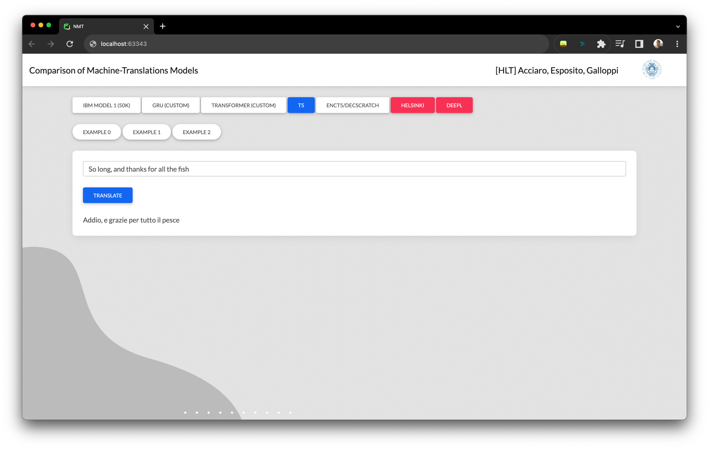

# Comparison of Machine-Translations Models

 

       
    

    Master Degree (Artificial Intelligence/Big Data curriculum) 
    HLT course, Academic Year: 2021/2022, University of Pisa, Italy.
    

  

 
<h3>👨🏻‍💻 Authors</h3>
    <a href="mailto:g.acciaro@studenti.unipi.it">Gennaro Daniele Acciaro</a>
    ·
    <a href="mailto:r.esposito8@studenti.unipi.it">Roberto Esposito</a>   
    ·
    <a href="mailto:g.galloppi@studenti.unipi.it">Giuliano Galloppi</a>
  

    

    <h3><a href="./report.pdf"> 📃 Report</a></h3>
  

    <!-- 

            <h3><a href="./slides.pdf">Slides</a></h3>
          

        -->

## 🔍 Abstract
"Machine Translation" (MT) refers to that process of automatically translating a text from one "source" language to another "target" language. 
In this report we explore two possible approaches to deal with this task: Statistical and Neural.
In particular, we implemented several models from scratch and compared them with models that represent the state of the art.

## 🔧 Setup
The files containing the weights of the various models used were not included in this repository because they are very large files.
Therefore, in order for the program to work, it is necessary to download the weights files using the following command.

    ./download_weights.sh

## 🖥 GUI

 

       
  

### Main Files

    📦 Comparison of Machine-Translations Models
     ┣ 📂 controller             // contains the files to use the models
     ┣ 📂 dataset                
     ┣ 📂 evaluation             // contains the files used to evaluate the models
     ┣ 📂 gui                    
     ┣ 📂 model_selection        // files and notebooks for the various Random Search
     ┣ 📂 models                 // this folder is downloaded with the script, it contains the weights of the models
     ┗ 📜 app.py                 // main file for the application
